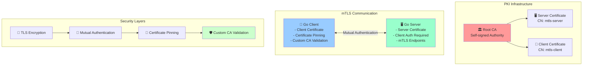

# 🎯 mTLS with Certificate Pinning - Complete Implementation Guide

This directory contains a complete implementation of **Mutual TLS (mTLS)** with **certificate pinning** in Go, demonstrating enterprise-grade security practices for service-to-service communication.

## 🏗️ Architecture Overview



## 📂 Project Structure

```
certs/app/
├── 📋 README.md                 # This comprehensive guide
├── 🔧 Makefile                  # Build and run commands
├── 🎭 demo.sh                   # Complete demo script
├── 🔐 generate-certs.sh         # Certificate generation
├── 🚀 go.mod                    # Go module (root)
│
├── server/                      # mTLS Server
│   ├── 🖥️ server.go             # Server implementation
│   └── 📦 go.mod                # Server module
│
├── client/                      # mTLS Client
│   ├── 📱 client.go             # Client with pinning
│   └── 📦 go.mod                # Client module
│
└── certs/                       # Generated Certificates
    ├── 🏛️ ca.crt                # Root CA certificate
    ├── 🔑 ca.key                # Root CA private key
    ├── 🖥️ server.crt            # Server certificate
    ├── 🔑 server.key            # Server private key
    ├── 👤 client.crt            # Client certificate
    └── 🔑 client.key            # Client private key
```

## 🚀 Quick Start Guide

### 1. 🔐 Generate Certificates
```bash
make certs
# or
./generate-certs.sh
```

### 2. 🖥️ Start Server (Terminal 1)
```bash
make server
# Server starts on https://localhost:8443
```

### 3. 📱 Run Client (Terminal 2)
```bash
make client
# Client connects and tests all endpoints
```

### 4. 🎭 Or Run Complete Demo
```bash
./demo.sh
# Runs full demo including security tests
```

## 🔍 What Each Component Does

### 🏛️ Certificate Authority (CA)
- **Self-signed root certificate** for the demo PKI
- **Signs both server and client certificates**
- **4096-bit RSA key** for maximum security
- **10-year validity** for demo purposes

### 🖥️ mTLS Server (`server/server.go`)

**Key Features:**
- ✅ **Requires client certificates** (mutual authentication)
- ✅ **Verifies client certificates** against custom CA
- ✅ **TLS 1.2+ only** for security
- ✅ **Multiple endpoints** for testing
- ✅ **Detailed logging** of client certificate info
- ✅ **Security timeouts** and headers

**Endpoints:**
```bash
GET  /hello  # Simple greeting with client CN
POST /echo   # Echo JSON payload
GET  /info   # Detailed TLS and certificate info
```

**TLS Configuration:**
```go
tlsConfig := &tls.Config{
    Certificates: []tls.Certificate{serverCert},     // Server cert
    ClientAuth:   tls.RequireAndVerifyClientCert,    // Require client cert
    ClientCAs:    caCertPool,                        // Custom CA for client verification
    MinVersion:   tls.VersionTLS12,                  // Security minimum
}
```

### 📱 mTLS Client (`client/client.go`)

**Key Features:**
- ✅ **Presents client certificate** for authentication
- ✅ **Implements certificate pinning** (SHA-256 public key hash)
- ✅ **Custom CA validation** (doesn't use system trust store)
- ✅ **Tests multiple endpoints** (GET and POST)
- ✅ **Detailed error handling** and logging
- ✅ **MITM attack prevention**

**Certificate Pinning Implementation:**
```go
// Hardcoded expected server public key hash
const expectedServerPubKeyHash = "61b3d84923a7a6326cabab402810fa3a4cd0e657d4bb67dcad4470a16575a255"

// Custom verification function
VerifyPeerCertificate: func(rawCerts [][]byte, verifiedChains [][]*x509.Certificate) error {
    // Calculate actual public key hash
    cert, _ := x509.ParseCertificate(rawCerts[0])
    pubKeyDER, _ := x509.MarshalPKIXPublicKey(cert.PublicKey)
    hash := sha256.Sum256(pubKeyDER)
    actualHash := hex.EncodeToString(hash[:])
    
    // Compare with pinned hash
    if actualHash != expectedServerPubKeyHash {
        return fmt.Errorf("CERTIFICATE PINNING FAILED")
    }
    return nil
}
```

## 🛡️ Security Features Demonstrated

### 1. 🤝 Mutual Authentication
- **Both client and server** present certificates
- **Cryptographic proof** of identity on both sides
- **No username/password** authentication needed

### 2. 📌 Certificate Pinning
- **Hardcoded server public key hash** in client
- **Prevents MITM attacks** even with rogue CAs
- **Immediate detection** of certificate replacement

### 3. 🏛️ Custom PKI
- **Self-managed Certificate Authority**
- **Application-specific trust** (not system-wide)
- **Complete control** over certificate lifecycle

### 4. 🔐 TLS Security
- **TLS 1.2+ only** (no weak versions)
- **Strong cipher suites** preferred
- **Perfect Forward Secrecy** support

## 🧪 Security Testing Scenarios

### ✅ Normal Operation Test
```bash
make test
# Expected: ✅ Successful mTLS connection with pinning verification
```

### 🚨 Certificate Replacement Attack
```bash
# Replace server certificate with different valid certificate
cp certs/server.crt certs/server.crt.backup
openssl genrsa -out certs/fake.key 4096
openssl req -new -key certs/fake.key -out certs/fake.csr -subj "/CN=mtls-server"
openssl x509 -req -in certs/fake.csr -CA certs/ca.crt -CAkey certs/ca.key -out certs/server.crt

# Test client connection
make client
# Expected: ❌ CERTIFICATE PINNING FAILED error
```

### 🕷️ MITM Proxy Test
```bash
# Using mitmproxy or similar
mitmproxy --listen-port 8080
export HTTPS_PROXY=localhost:8080

make client
# Expected: ❌ Certificate pinning blocks proxy certificate
```

### 🚫 Missing Client Certificate Test
```bash
# Remove client certificate
mv certs/client.crt certs/client.crt.backup

make client
# Expected: ❌ Client certificate required error
```

## 📊 Security Comparison

| Security Feature | Regular HTTPS | mTLS | mTLS + Pinning |
|------------------|---------------|------|----------------|
| **Server Authentication** | ✅ | ✅ | ✅ |
| **Client Authentication** | ❌ | ✅ | ✅ |
| **MITM Protection** | ⚠️ Depends on CA trust | ✅ Strong | ✅ Maximum |
| **Rogue CA Protection** | ❌ | ❌ | ✅ |
| **Certificate Replacement Protection** | ❌ | ❌ | ✅ |
| **Zero Trust Ready** | ❌ | ✅ | ✅ |

## 🔧 Production Considerations

### 🏭 For Production Deployment:

1. **Certificate Management**
   ```bash
   # Use proper CA (not self-signed)
   # Implement certificate rotation
   # Set up expiration monitoring
   # Use Hardware Security Modules (HSM)
   ```

2. **Certificate Pinning Strategy**
   ```go
   // Pin multiple certificates for rotation
   pinnedHashes := []string{
       "current_cert_hash",
       "backup_cert_hash",
       "rotation_cert_hash",
   }
   
   // Implement emergency bypass (with extreme caution)
   emergencyBypass := os.Getenv("EMERGENCY_BYPASS") == "true"
   ```

3. **Monitoring and Alerting**
   ```go
   // Monitor certificate pinning failures
   // Alert on unusual connection patterns
   // Track certificate expiration dates
   // Log all authentication events
   ```

4. **Certificate Storage**
   ```bash
   # Store private keys securely
   chmod 600 *.key
   chown app:app *.key
   
   # Use secrets management (Vault, K8s secrets)
   # Never commit private keys to version control
   ```

## 🎓 Educational Value

This implementation demonstrates:

- **Enterprise security patterns** for service-to-service communication
- **Defense in depth** security approach
- **Zero-trust networking** principles
- **PKI management** best practices
- **Go crypto/tls** package advanced usage
- **Certificate-based authentication** implementation
- **Man-in-the-middle attack prevention**

## 🔗 Related Concepts

- **Service Mesh Security** (Istio, Linkerd)
- **Kubernetes mTLS** (cert-manager, service mesh)
- **API Gateway Security** (mutual TLS for APIs)
- **Microservices Authentication** (service-to-service auth)
- **Zero Trust Architecture** (never trust, always verify)

## 🧩 Integration Examples

### Kubernetes Deployment
```yaml
apiVersion: v1
kind: Secret
metadata:
  name: mtls-certs
type: kubernetes.io/tls
data:
  tls.crt: <base64-encoded-cert>
  tls.key: <base64-encoded-key>
  ca.crt: <base64-encoded-ca>
```

### Docker Compose
```yaml
services:
  mtls-server:
    build: ./server
    ports:
      - "8443:8443"
    volumes:
      - ./certs:/app/certs:ro
    environment:
      - TLS_CERT_FILE=/app/certs/server.crt
      - TLS_KEY_FILE=/app/certs/server.key
```

### Service Mesh Integration
```yaml
apiVersion: security.istio.io/v1beta1
kind: PeerAuthentication
metadata:
  name: mtls-required
spec:
  mtls:
    mode: STRICT  # Require mTLS for all traffic
```

## 🎯 Next Steps

After mastering this implementation:

1. **Implement certificate rotation** automation
2. **Add OCSP/CRL validation** for revocation checking
3. **Integrate with service discovery** (Consul, etcd)
4. **Add metrics and monitoring** (Prometheus, Grafana)
5. **Implement load balancing** with mTLS
6. **Create Kubernetes operators** for certificate management
7. **Build CI/CD pipelines** with certificate automation

---

This implementation provides a solid foundation for understanding and implementing enterprise-grade mTLS authentication with certificate pinning in Go applications. 🚀🔐
