# 🔐 Transport Layer Security (TLS) and Mutual TLS (mTLS) - Complete Guide

## 📚 Table of Contents
1. [What is TLS?](#what-is-tls)
2. [What is Mutual TLS (mTLS)?](#what-is-mutual-tls-mtls)
3. [TLS vs mTLS Comparison](#tls-vs-mtls-comparison)
4. [TLS Handshake Process](#tls-handshake-process)
5. [mTLS Handshake Process](#mtls-handshake-process)
6. [Certificate Validation](#certificate-validation)
7. [Certificate Pinning](#certificate-pinning)
8. [Certificate Storage Strategies](#certificate-storage-strategies)
9. [Security Implications](#security-implications)
10. [Practical Implementation](#practical-implementation)

---

## 🔒 What is TLS?

**Transport Layer Security (TLS)** is a cryptographic protocol that provides **secure communication** over a computer network. It's the successor to SSL (Secure Sockets Layer) and is widely used to secure web traffic (HTTPS), email, and other internet communications.

### 🎯 Key Purposes of TLS:
1. **Encryption**: Protects data in transit from eavesdropping
2. **Authentication**: Verifies the identity of communicating parties
3. **Integrity**: Ensures data hasn't been tampered with during transmission

### 🔧 How TLS Works:


### 🔑 Regular TLS Authentication:
- **Server authenticates to client** using certificate
- **Client verifies server certificate** against trusted CAs
- **Client does NOT present a certificate** to server
- **One-way authentication**

---

## 🤝 What is Mutual TLS (mTLS)?

**Mutual TLS (mTLS)** extends regular TLS by requiring **both the client and server to authenticate each other** using digital certificates. This creates a **two-way authentication** mechanism.

### 🎯 Key Features of mTLS:
1. **Bidirectional Authentication**: Both parties prove their identity
2. **Enhanced Security**: Stronger than username/password authentication
3. **Certificate-Based**: Uses PKI (Public Key Infrastructure)
4. **Zero-Trust Architecture**: Perfect for microservices and API security

### 🏢 Common Use Cases:
- **Microservices Communication**: Service-to-service authentication
- **API Security**: High-security API access
- **IoT Device Authentication**: Device-to-server communication
- **Banking and Financial Systems**: High-value transaction security
- **Government and Military**: Top-secret communications

---

## ⚖️ TLS vs mTLS Comparison

| Aspect | Regular TLS | Mutual TLS (mTLS) |
|--------|-------------|-------------------|
| **Authentication** | Server only | Both client and server |
| **Certificates Required** | Server certificate only | Server + Client certificates |
| **Use Cases** | Web browsing, public APIs | Microservices, high-security APIs |
| **Setup Complexity** | Simple | More complex |
| **Security Level** | Good for public internet | Excellent for private networks |
| **Client Requirements** | Any browser/client | Must have valid certificate |

### 🔍 Visual Comparison:

**Regular TLS:**

```mermaid
graph LR
    Client["🖥️ Client<br/>(No Certificate)"] 
    Server["🏢 Server<br/>(Has Certificate)"]
    
    Client -->|"Verifies server cert"| Server
    Server -.->|"Trusts any client"| Client
    
    style Server fill:#90EE90
    style Client fill:#FFE4B5
```


**Mutual TLS:**

```mermaid
graph LR
    Client["🖥️ Client<br/>(Has Certificate)"] 
    Server["🏢 Server<br/>(Has Certificate)"]
    
    Client <-->|"Mutual verification"| Server
    
    style Server fill:#90EE90
    style Client fill:#90EE90
```


---

## 🤝 TLS Handshake Process (Regular TLS)

### Step-by-Step Breakdown:



```mermaid
sequenceDiagram
    participant C as Client
    participant S as Server
    
    Note over C,S: Phase 1: Hello Messages
    C->>S: 1. ClientHello
    Note right of C: • TLS version<br/>• Cipher suites<br/>• Random number<br/>• Session ID
    
    S->>C: 2. ServerHello
    Note left of S: • Chosen TLS version<br/>• Chosen cipher suite<br/>• Random number<br/>• Session ID
    
    Note over C,S: Phase 2: Server Authentication
    S->>C: 3. Certificate
    Note left of S: • Server's public key<br/>• Certificate chain<br/>• Digital signature
    
    S-->C: 4. ServerHelloDone
    Note left of S: Server finished sending
    
    Note over C,S: Phase 3: Client Key Exchange
    C->>S: 5. ClientKeyExchange
    Note right of C: • Pre-master secret<br/>(encrypted with server's public key)
    
    Note over C,S: Phase 4: Finish
    C->>S: 6. ChangeCipherSpec
    C->>S: 7. Finished
    Note right of C: Encrypted with session key
    
    S->>C: 8. ChangeCipherSpec
    S->>C: 9. Finished
    Note left of S: Encrypted with session key
    
    Note over C,S: 🔒 Secure Channel Established
    C->>S: Application Data (Encrypted)
```

### 🔑 Key Points:
1. **Client initiates** the handshake
2. **Server proves identity** with certificate
3. **Client verifies** server certificate
4. **Session keys** are generated from shared secrets
5. **No client authentication** required

---

## 🔐 mTLS Handshake Process (Mutual Authentication)

### Step-by-Step Breakdown:



```mermaid
sequenceDiagram
    participant C as Client
    participant S as Server
    
    Note over C,S: Phase 1: Hello Messages
    C->>S: 1. ClientHello
    Note right of C: • TLS version<br/>• Cipher suites<br/>• Random number
    
    S->>C: 2. ServerHello
    Note left of S: • Chosen TLS version<br/>• Chosen cipher suite<br/>• Random number
    
    Note over C,S: Phase 2: Server Authentication
    S->>C: 3. Certificate
    Note left of S: Server certificate chain
    
    S->>C: 4. CertificateRequest
    Note left of S: • Acceptable CA list<br/>• Certificate types<br/>• Signature algorithms
    
    S->>C: 5. ServerHelloDone
    
    Note over C,S: Phase 3: Client Authentication
    C->>S: 6. Certificate
    Note right of C: Client certificate chain
    
    C->>S: 7. ClientKeyExchange
    Note right of C: Pre-master secret
    
    C->>S: 8. CertificateVerify
    Note right of C: Proof of private key ownership<br/>(signed with client's private key)
    
    Note over C,S: Phase 4: Finish
    C->>S: 9. ChangeCipherSpec
    C->>S: 10. Finished
    
    S->>C: 11. ChangeCipherSpec
    S->>C: 12. Finished
    
    Note over C,S: 🔒 Mutually Authenticated Secure Channel
    C<<->>S: Application Data (Encrypted)
```

### 🔑 Key Differences from Regular TLS:
1. **CertificateRequest**: Server asks for client certificate
2. **Client Certificate**: Client sends its certificate
3. **CertificateVerify**: Client proves it owns the private key
4. **Mutual Verification**: Both parties authenticate each other

---

## 🏛️ Certificate Validation Process

### 📋 What Gets Validated:


### 🔍 Validation Steps:

1. **Certificate Chain Validation**
   ```
   Root CA → Intermediate CA → End Entity Certificate
   Each link must be cryptographically valid
   ```

2. **Trusted Root CA Check**
   ```
   Is the root CA in our trusted store?
   - System trust store (/etc/ssl/certs/)
   - Application trust store
   - Custom CA bundle
   ```

3. **Expiration Check**
   ```
   Current Date: 2025-07-01
   Not Before:   2024-01-01  ✅
   Not After:    2025-12-31  ✅
   Status: Valid
   ```

4. **Hostname Verification**
   ```
   Certificate CN: example.com
   SAN: example.com, www.example.com, api.example.com
   Connecting to: api.example.com ✅
   ```

5. **Revocation Check** (Optional but recommended)
   ```
   • CRL (Certificate Revocation List)
   • OCSP (Online Certificate Status Protocol)
   ```

### 🏗️ Certificate Chain Structure:

```mermaid
graph TD
    subgraph "Certificate Chain"
        A["🏛️ Root CA<br/>Self-signed<br/>Long-lived (10+ years)"]
        B["🏢 Intermediate CA<br/>Signed by Root<br/>Medium-lived (3-5 years)"]
        C["🖥️ End Entity Certificate<br/>Signed by Intermediate<br/>Short-lived (1-2 years)"]
    end
    
    A --> B
    B --> C
    
    style A fill:#ff9999
    style B fill:#ffcc99
    style C fill:#99ccff
```



---

## 📌 Certificate Pinning

### 🎯 What is Certificate Pinning?

**Certificate pinning** is a security technique where an application **hardcodes trust** for specific certificates or public keys, instead of relying solely on the system's Certificate Authority (CA) trust store.

### 🔑 Types of Pinning:

1. **Certificate Pinning**: Pin the entire certificate
2. **Public Key Pinning**: Pin the public key only (recommended)
3. **CA Pinning**: Pin the Certificate Authority

### 🛡️ Why Use Certificate Pinning?

```mermaid
graph TD
    subgraph "Without Pinning"
        A1[App] --> B1[System CA Store]
        B1 --> C1[Any Valid Certificate]
        C1 --> D1[⚠️ MITM Possible with Rogue CA]
    end
    
    subgraph "With Pinning"
        A2[App] --> B2[Hardcoded Public Key Hash]
        B2 --> C2[Specific Certificate Only]
        C2 --> D2[✅ MITM Prevented]
    end
    
    style D1 fill:#ffcccc
    style D2 fill:#ccffcc
```



### 🔧 Implementation in Go:

```go
// Calculate expected public key hash
func calculatePublicKeyHash(cert *x509.Certificate) string {
    pubKeyDER, _ := x509.MarshalPKIXPublicKey(cert.PublicKey)
    hash := sha256.Sum256(pubKeyDER)
    return hex.EncodeToString(hash[:])
}

// Custom certificate verification with pinning
tlsConfig := &tls.Config{
    VerifyPeerCertificate: func(rawCerts [][]byte, verifiedChains [][]*x509.Certificate) error {
        cert, _ := x509.ParseCertificate(rawCerts[0])
        actualHash := calculatePublicKeyHash(cert)
        
        if actualHash != expectedHash {
            return fmt.Errorf("certificate pinning failed")
        }
        return nil
    },
}
```

### ⚠️ Certificate Pinning Challenges:

1. **Certificate Rotation**: What happens when certificates expire?
2. **Backup Pins**: Need multiple pinned certificates
3. **Emergency Updates**: How to handle compromised certificates?
4. **Deployment Complexity**: Managing pins across applications

---

## 🗄️ Certificate Storage Strategies

### 🤔 Where to Store CA Certificates?

#### Option 1: System Trust Store

**Location (Linux):**
```bash
/etc/ssl/certs/                    # System CA certificates
/usr/local/share/ca-certificates/  # Local CA certificates
/etc/ca-certificates.conf          # Configuration
```

**Pros:**
- ✅ Available to all applications
- ✅ Managed by system administrator
- ✅ Standard certificate management tools
- ✅ Automatic updates via package manager

**Cons:**
- ❌ Affects entire system (security risk)
- ❌ Requires root access to modify
- ❌ May be overwritten by system updates
- ❌ Not application-specific

**When to Use:**
- Development/testing environments
- Enterprise environments with centralized management
- When multiple applications need the same CA

**Commands:**
```bash
# Add custom CA to system trust store
sudo cp ca.crt /usr/local/share/ca-certificates/
sudo update-ca-certificates

# Verify system trust
openssl verify -CAfile /etc/ssl/certs/ca-certificates.crt server.crt
```

#### Option 2: Application-Level Trust Store

**Implementation:**
```go
// Load custom CA in application
caCert, err := ioutil.ReadFile("certs/ca.crt")
caCertPool := x509.NewCertPool()
caCertPool.AppendCertsFromPEM(caCert)

tlsConfig := &tls.Config{
    RootCAs: caCertPool,  // Use custom CA instead of system
}
```

**Pros:**
- ✅ Application-specific security
- ✅ No system-wide impact
- ✅ Version controlled with application
- ✅ No root privileges required
- ✅ Portable across environments

**Cons:**
- ❌ Must be managed per application
- ❌ No automatic updates
- ❌ Requires application restart for updates
- ❌ More complex deployment

**When to Use:**
- Production applications (recommended)
- Microservices architectures
- Security-sensitive applications
- Multi-tenant environments

### 📊 Comparison Table:

| Aspect | System Trust Store | Application Trust Store |
|--------|-------------------|------------------------|
| **Security Scope** | System-wide | Application-specific |
| **Privileges Required** | Root/Admin | User-level |
| **Management** | Centralized | Distributed |
| **Updates** | Automatic | Manual |
| **Isolation** | Low | High |
| **Best For** | Development | Production |

---

## 🛡️ Security Implications

### 🚨 Man-in-the-Middle (MITM) Attack Scenarios

#### Scenario 1: Regular TLS without Pinning


#### Scenario 2: With Certificate Pinning


### 🔒 mTLS Security Benefits

1. **Strong Authentication**: Cryptographic proof of identity
2. **Non-repudiation**: Actions can be traced to specific certificates
3. **Encryption**: All communication is encrypted
4. **Integrity**: Data tampering is detected
5. **Zero Trust**: No implicit trust relationships

### ⚠️ Common Security Mistakes

1. **Weak Private Key Protection**
   ```bash
   # ❌ Bad: World-readable private key
   chmod 644 server.key
   
   # ✅ Good: Restricted access
   chmod 600 server.key
   chown app:app server.key
   ```

2. **Insufficient Certificate Validation**
   ```go
   // ❌ Bad: Skip certificate validation
   tlsConfig := &tls.Config{
       InsecureSkipVerify: true,  // Never do this in production!
   }
   
   // ✅ Good: Proper validation
   tlsConfig := &tls.Config{
       RootCAs: customCAPool,
       ServerName: "expected-server-name",
   }
   ```

3. **Ignoring Certificate Expiration**
   ```bash
   # Monitor certificate expiration
   openssl x509 -in server.crt -noout -dates
   
   # Set up automated alerts before expiration
   ```

---

## 🔬 Practical Implementation Notes

### 🐛 Common Error Scenarios

#### 1. **Certificate Chain Issues**
```
Error: x509: certificate signed by unknown authority
Cause: CA certificate not in trust store
Solution: Add CA to RootCAs in tls.Config
```

#### 2. **Hostname Verification Failures**
```
Error: x509: certificate is valid for mtls-server, not localhost
Cause: Certificate CN/SAN doesn't match connection hostname
Solution: Use correct hostname or add SAN entries
```

#### 3. **Client Certificate Not Provided**
```
Error: tls: client didn't provide a certificate
Cause: Server requires client cert but client didn't send one
Solution: Configure client to send certificate
```

#### 4. **Certificate Pinning Failures**
```
Error: certificate pinning failed: expected abc123, got def456
Cause: Server certificate changed or pinned hash is wrong
Solution: Update pinned hash or verify certificate change is legitimate
```

### 🔧 Debugging Commands

```bash
# Test TLS connection
openssl s_client -connect localhost:8443 -servername mtls-server

# Test with client certificate
openssl s_client -connect localhost:8443 -cert client.crt -key client.key

# Verify certificate chain
openssl verify -CAfile ca.crt server.crt

# Check certificate details
openssl x509 -in server.crt -text -noout

# Calculate public key hash (for pinning)
openssl x509 -in server.crt -pubkey -noout | openssl pkey -pubin -outform DER | openssl dgst -sha256 -hex
```

### 📈 Performance Considerations

1. **TLS Handshake Overhead**: mTLS requires additional round trips
2. **Certificate Validation**: CPU-intensive cryptographic operations
3. **Connection Reuse**: Implement connection pooling to amortize handshake cost
4. **Session Resumption**: Reuse TLS sessions when possible

### 🏗️ Production Deployment Checklist

- [ ] Use certificates from trusted CA (or secure custom CA)
- [ ] Implement certificate rotation procedures
- [ ] Set up certificate expiration monitoring
- [ ] Use strong cipher suites only
- [ ] Implement proper error handling and logging
- [ ] Regular security audits and penetration testing
- [ ] Backup and recovery procedures for certificates
- [ ] Certificate revocation procedures

---

## 🎓 Educational Summary

This guide covered the complete journey from basic TLS to advanced mTLS with certificate pinning. Understanding these concepts is crucial for:

- **Security Engineers**: Implementing zero-trust architectures
- **DevOps Engineers**: Securing microservices communication
- **Software Developers**: Building secure applications
- **System Administrators**: Managing PKI infrastructure

The practical implementation demonstrates real-world usage patterns and common pitfalls, making it an excellent foundation for building production-ready secure systems.
