# 🚨 mTLS Security Scenarios and Attack Vectors

## 📚 Table of Contents
1. [Attack Scenarios](#attack-scenarios)
2. [Certificate Replacement Impact](#certificate-replacement-impact)
3. [MITM Proxy Interception](#mitm-proxy-interception)
4. [Certificate Validation Errors](#certificate-validation-errors)
5. [Defensive Measures](#defensive-measures)
6. [Testing and Simulation](#testing-and-simulation)

---

## 🎯 Attack Scenarios

### 1. 🕷️ Man-in-the-Middle (MITM) Attack

#### Without Certificate Pinning:

```mermaid
sequenceDiagram
    participant Client
    participant Attacker as 🕷️ Attacker Proxy
    participant Server
    
    Note over Client,Server: Normal TLS Connection Attempt
    
    Client->>Attacker: ClientHello
    Attacker->>Server: Forward ClientHello
    Server->>Attacker: ServerHello + Real Certificate
    
    Note over Attacker: Attacker generates fake certificate<br/>for server domain
    
    Attacker->>Client: ServerHello + Fake Certificate
    
    Note over Client: Client validates fake certificate<br/>against system CA store
    
    alt If Attacker's CA is trusted
        Client->>Attacker: ✅ Accept fake certificate
        Note over Attacker: 🚨 MITM successful!<br/>Can decrypt/modify traffic
    else If Attacker's CA not trusted
        Client->>Client: ❌ Certificate validation fails
        Note over Client: Connection terminated
    end
```


#### With Certificate Pinning:

```mermaid
sequenceDiagram
    participant Client
    participant Attacker as 🕷️ Attacker Proxy
    participant Server
    
    Client->>Attacker: ClientHello
    Attacker->>Server: Forward ClientHello
    Server->>Attacker: ServerHello + Real Certificate
    Attacker->>Client: ServerHello + Fake Certificate
    
    Note over Client: Certificate pinning validation
    
    Client->>Client: Calculate public key hash
    Client->>Client: Compare with pinned hash
    
    Note over Client: ❌ Hash mismatch detected!<br/>🛡️ Pinning prevents MITM
    
    Client-->>Attacker: Connection Rejected
```


### 2. 🎭 Rogue Certificate Authority (CA)

**Scenario:** An attacker compromises a Certificate Authority or uses a rogue CA that's been added to the system trust store.

```mermaid 
    graph TD
    A[Trusted Root CA 🏛️] --> B[Legitimate Intermediate CA 🏢]
    A --> C[Rogue Intermediate CA 😈]
    
    B --> D[Real Server Certificate ✅]
    C --> E[Fake Server Certificate 🚨\nSame Domain]
    
    F[Client] --> G{Certificate Validation}
    G --> H{Is CA Trusted?}
    H -->|Yes| I[Accept Certificate ✅]
    H -->|No| J[Reject Certificate ❌]

```



**Impact:**
- Client accepts fake certificate because it's signed by "trusted" CA
- Attacker can decrypt all traffic
- **Certificate pinning prevents this attack**

### 3. 🔄 Certificate Replacement Attack

**Scenario:** Attacker replaces legitimate server certificate with their own valid certificate.

```bash
# Attacker generates valid certificate for same domain
openssl req -new -key attacker.key -out attacker.csr \
  -subj "/CN=mtls-server"

# Gets it signed by compromised CA
openssl x509 -req -in attacker.csr -CA compromised-ca.crt \
  -CAkey compromised-ca.key -out attacker.crt
```

**Without Pinning:**
- Certificate is valid for the domain ✅
- Signed by trusted CA ✅
- Not expired ✅
- **Attack succeeds** 🚨

**With Pinning:**
- Public key hash doesn't match pinned hash ❌
- **Attack fails** 🛡️

---

## 🔄 Certificate Replacement Impact

### Scenario: Server Certificate Changes

Let's simulate what happens when the server certificate changes:

#### 1. **Generate New Server Certificate**
```bash
# Original certificate
openssl x509 -in certs/server.crt -pubkey -noout | \
  openssl pkey -pubin -outform DER | \
  openssl dgst -sha256 -hex
# Output: abc123...

# Generate new certificate
openssl genrsa -out new-server.key 4096
openssl req -new -key new-server.key -out new-server.csr \
  -subj "/CN=mtls-server"
openssl x509 -req -in new-server.csr -CA ca.crt -CAkey ca.key \
  -out new-server.crt -days 365

# New certificate hash
openssl x509 -in new-server.crt -pubkey -noout | \
  openssl pkey -pubin -outform DER | \
  openssl dgst -sha256 -hex
# Output: def456... (different!)
```

#### 2. **Impact on Client Connection**

**Client Code Response:**
```go
// In client.go - verifyServerCertificateWithPinning function
func verifyServerCertificateWithPinning(rawCerts [][]byte, verifiedChains [][]*x509.Certificate) error {
    // ... calculate actualHash ...
    
    if actualHash != expectedServerPubKeyHash {
        return fmt.Errorf("🚨 CERTIFICATE PINNING FAILED: expected %s, got %s", 
                         expectedServerPubKeyHash, actualHash)
    }
    
    return nil
}
```

**Error Output:**
```
🚨 CERTIFICATE PINNING FAILED: expected abc123..., got def456...
❌ GET request failed: Get "https://localhost:8443/hello": 
   certificate pinning verification failed
```

#### 3. **Legitimate vs Malicious Changes**

**Legitimate Certificate Rotation:**


**Malicious Certificate Replacement:**

```mermaid
graph TD
    A[Attacker Access] --> B[Replace Server Certificate]
    B --> C[Client Connects]
    C --> D[Pinning Check Fails]
    D --> E[Connection Rejected]
    E --> F[🛡️ Attack Prevented]
    
    style A fill:#ffcccc
    style F fill:#ccffcc
```


---

## 🕷️ MITM Proxy Interception

### Using mitmproxy to Demonstrate Interception

#### 1. **Setup mitmproxy**
```bash
# Install mitmproxy
pip install mitmproxy

# Start mitmproxy
mitmproxy -s ~/.mitmproxy/custom_script.py --listen-port 8080
```

#### 2. **Custom mitmproxy Script**
```python
# ~/.mitmproxy/custom_script.py
from mitmproxy import http
import json

def response(flow: http.HTTPFlow) -> None:
    """Intercept and modify responses"""
    
    if "mtls-server" in flow.request.pretty_host:
        print(f"🕷️ Intercepted request to {flow.request.pretty_host}")
        print(f"📡 Method: {flow.request.method}")
        print(f"🛤️ Path: {flow.request.path}")
        
        # Modify response
        if flow.response:
            try:
                data = json.loads(flow.response.content)
                data["injected"] = "🚨 This response was modified by MITM proxy!"
                flow.response.content = json.dumps(data).encode()
                print("🔄 Response modified!")
            except:
                pass
```

#### 3. **Attempt Interception of mTLS Connection**

**Without Certificate Pinning:**
```bash
# Route traffic through proxy
export HTTPS_PROXY=http://localhost:8080

# Install mitmproxy CA
cat ~/.mitmproxy/mitmproxy-ca-cert.pem >> /etc/ssl/certs/ca-certificates.crt

# Run client - might succeed if CA is trusted
go run client.go
```

**With Certificate Pinning:**
```bash
# Run client - will fail due to pinning
go run client.go

# Expected output:
# 🚨 CERTIFICATE PINNING FAILED: expected abc123..., got def456...
# ❌ Connection rejected by certificate pinning
```

#### 4. **Proxy Detection Mechanisms**

**Code to Detect Proxy:**
```go
func detectProxy(cert *x509.Certificate) bool {
    // Check for common proxy certificate indicators
    proxyIndicators := []string{
        "mitmproxy",
        "Burp Suite",
        "OWASP ZAP",
        "Charles Proxy",
    }
    
    for _, indicator := range proxyIndicators {
        if strings.Contains(cert.Issuer.CommonName, indicator) ||
           strings.Contains(cert.Subject.CommonName, indicator) {
            return true
        }
    }
    
    return false
}
```

---

## ❌ Certificate Validation Errors

### Common Error Scenarios and Solutions

#### 1. **Unknown Certificate Authority**
```
Error: x509: certificate signed by unknown authority
```

**Cause:** CA certificate not in trust store

**Simulation:**
```bash
# Remove CA from trust store
sudo rm /usr/local/share/ca-certificates/ca.crt
sudo update-ca-certificates

# Run client - will fail
go run client.go
```

**Solution:**
```go
// Load custom CA in application
caCert, err := ioutil.ReadFile("certs/ca.crt")
caCertPool := x509.NewCertPool()
caCertPool.AppendCertsFromPEM(caCert)

tlsConfig := &tls.Config{
    RootCAs: caCertPool,  // Use custom CA pool
}
```

#### 2. **Hostname Verification Failure**
```
Error: x509: certificate is valid for mtls-server, not localhost
```

**Cause:** Certificate CN/SAN doesn't match connection hostname

**Simulation:**
```bash
# Connect using different hostname
curl --cacert certs/ca.crt --cert certs/client.crt --key certs/client.key \
     https://127.0.0.1:8443/hello
```

**Solution:**
```go
tlsConfig := &tls.Config{
    ServerName: "mtls-server",  // Must match certificate CN
}
```

#### 3. **Certificate Expired**
```
Error: x509: certificate has expired or is not yet valid
```

**Simulation:**
```bash
# Generate expired certificate
openssl x509 -req -in server.csr -CA ca.crt -CAkey ca.key \
  -out expired-server.crt -days -1  # Expired yesterday
```

#### 4. **Client Certificate Required**
```
Error: tls: client didn't provide a certificate
```

**Simulation:**
```bash
# Try to connect without client certificate
curl --cacert certs/ca.crt https://localhost:8443/hello
```

**Server Response:**
```
❌ Client certificate verification failed
🚨 Connection terminated
```

---

## 🛡️ Defensive Measures

### 1. **Implement Certificate Pinning**

```go
// Multiple pinning strategies
type CertificatePinner struct {
    pinnedHashes    []string  // Primary pins
    backupHashes    []string  // Backup pins
    emergencyBypass bool      // Emergency bypass flag
}

func (p *CertificatePinner) VerifyPin(cert *x509.Certificate) error {
    hash := calculatePublicKeyHash(cert)
    
    // Check primary pins
    for _, pinnedHash := range p.pinnedHashes {
        if hash == pinnedHash {
            return nil
        }
    }
    
    // Check backup pins
    for _, backupHash := range p.backupHashes {
        if hash == backupHash {
            log.Printf("⚠️ Using backup certificate pin")
            return nil
        }
    }
    
    // Emergency bypass (use with extreme caution)
    if p.emergencyBypass {
        log.Printf("🚨 EMERGENCY BYPASS: Certificate pinning bypassed!")
        return nil
    }
    
    return fmt.Errorf("certificate pinning failed")
}
```

### 2. **Certificate Transparency Monitoring**

```go
// Monitor Certificate Transparency logs
func monitorCertificateTransparency(domain string) {
    // Query CT logs for unexpected certificates
    // https://crt.sh/?q=yourdomain.com
    // Alert if unknown certificates are issued
}
```

### 3. **Multiple Validation Layers**

```go
func comprehensiveCertificateValidation(cert *x509.Certificate) error {
    // Layer 1: Standard validation
    if err := cert.CheckSignatureFrom(caCert); err != nil {
        return fmt.Errorf("signature validation failed: %v", err)
    }
    
    // Layer 2: Certificate pinning
    if err := verifyCertificatePin(cert); err != nil {
        return fmt.Errorf("certificate pinning failed: %v", err)
    }
    
    // Layer 3: Certificate Transparency check
    if err := checkCertificateTransparency(cert); err != nil {
        return fmt.Errorf("CT verification failed: %v", err)
    }
    
    // Layer 4: Revocation check
    if err := checkRevocationStatus(cert); err != nil {
        return fmt.Errorf("revocation check failed: %v", err)
    }
    
    return nil
}
```

### 4. **Monitoring and Alerting**

```go
// Security monitoring
func securityMonitoring() {
    // Monitor for:
    // - Certificate pinning failures
    // - Unexpected certificate changes
    // - High number of connection failures
    // - Unusual TLS handshake patterns
    
    metrics := SecurityMetrics{
        PinningFailures:    prometheus.NewCounterVec(...),
        CertificateChanges: prometheus.NewGaugeVec(...),
        TLSErrors:         prometheus.NewHistogram(...),
    }
}
```

---

## 🧪 Testing and Simulation

### Automated Security Testing Script

```bash
#!/bin/bash
# security-test.sh

echo "🧪 Starting mTLS Security Tests..."

# Test 1: Normal operation
echo "Test 1: Normal mTLS connection"
timeout 5 go run client.go
echo "✅ Test 1 completed"

# Test 2: Certificate pinning with wrong certificate
echo "Test 2: Certificate pinning failure"
cp certs/server.crt certs/server.crt.backup
openssl req -new -x509 -key certs/server.key -out certs/server.crt -days 365 \
  -subj "/CN=mtls-server"
timeout 5 go run client.go 2>&1 | grep -q "CERTIFICATE PINNING FAILED" && \
  echo "✅ Certificate pinning correctly blocked fake certificate" || \
  echo "❌ Certificate pinning failed to block fake certificate"
mv certs/server.crt.backup certs/server.crt

# Test 3: Missing client certificate
echo "Test 3: Missing client certificate"
mv certs/client.crt certs/client.crt.backup
timeout 5 go run client.go 2>&1 | grep -q "no such file" && \
  echo "✅ Correctly failed without client certificate" || \
  echo "❌ Should have failed without client certificate"
mv certs/client.crt.backup certs/client.crt

# Test 4: Expired certificate
echo "Test 4: Expired certificate handling"
# Generate expired certificate and test...

echo "🧪 Security tests completed"
```

### Penetration Testing Checklist

- [ ] Test with expired certificates
- [ ] Test with revoked certificates  
- [ ] Test with certificates from untrusted CAs
- [ ] Test hostname verification bypass attempts
- [ ] Test certificate pinning bypass attempts
- [ ] Test with self-signed certificates
- [ ] Test with weak cipher suites
- [ ] Test connection without client certificates
- [ ] Test with malformed certificates
- [ ] Test MITM proxy interception
- [ ] Test certificate chain validation
- [ ] Performance testing under load

---

This comprehensive security analysis demonstrates how mTLS with certificate pinning provides robust protection against various attack vectors, while also highlighting the importance of proper implementation and testing.
